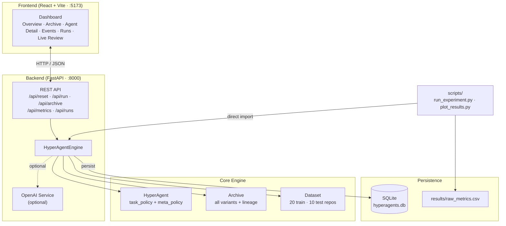
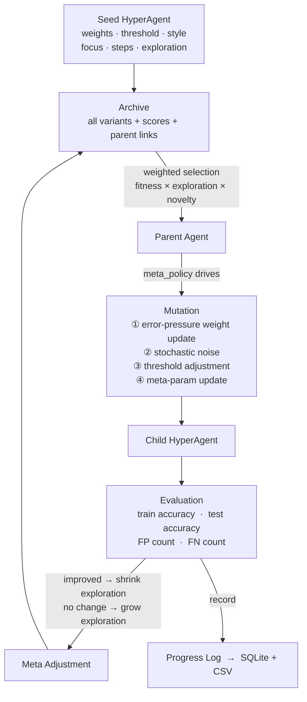
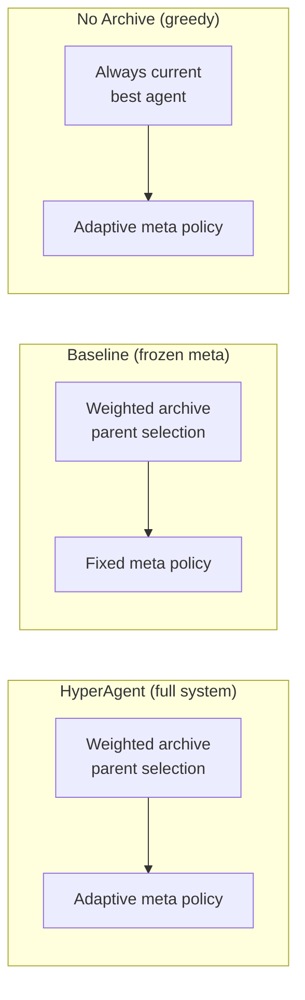

# hyperagents

`hyperagents` is a Python + React research artifact inspired by the HyperAgents paper (`arXiv:2603.19461v1`).

The core idea: an agent that improves not just its task behavior but also the policy that *produces* future improvements.

- A **task policy** solves a domain task (code-repository quality classification).
- A **meta policy** controls how the task policy mutates each iteration.
- A **hyperagent** bundles both into one editable record — so the mutation procedure is itself an evolvable artefact.
- An **archive** stores every discovered variant, enabling stepping-stone exploration past local optima.

## Architecture

### System Components



### Evolutionary Loop



### Ablation Conditions



> Full diagrams, database schema, API reference, and directory layout: [`docs/architecture.md`](docs/architecture.md).

---

## What Is Implemented

**Core loop**
- Evolutionary hyperagent loop with weighted archive parent selection
- Task policy self-modification: per-feature weights, decision threshold, review style
- Meta policy self-modification: step sizes, focus metric, exploration scale, memory notes
- Error-pressure mutation: false-positive and false-negative feature averages drive directional updates

**Ablation conditions** (selectable from the UI or experiment runner)
- `hyperagent` — full system (adaptive meta policy + archive)
- `baseline` — frozen meta policy, archive enabled (isolates meta-policy contribution)
- `no_archive` — adaptive meta policy, greedy parent selection (isolates archive contribution)

**Experiment infrastructure**
- Multi-seed runner (`scripts/run_experiment.py`): 3 conditions × 5 seeds × N iterations → `results/raw_metrics.csv`
- Learning curve plots (`scripts/plot_results.py`): mean ± std across seeds, train + test panels, meta-policy drift
- SQLite persistence: every run, agent variant, per-iteration metric, and mutation event is stored immediately

**Dataset**
- 20 training repositories (8 accepted, 12 rejected) — 10 clearly separated + 10 borderline
- 10 held-out test repositories (4 accepted, 6 rejected) — 6 clearly separated + 4 borderline
- Seed agent starts at ~65% train accuracy, leaving meaningful room for improvement

**UI (React, tabbed)**
- Overview: best agent stats, mode selector, run controls
- Archive: sortable table of all variants with fitness and parent links
- Agent Detail: weights, meta parameters, lineage notes, evaluation breakdown
- Events: mutation log
- Runs: saved experiment list with load / delete / CSV export
- Live Review: manual repository scoring (optional OpenAI)

---

## Project Structure

```text
hyperagents/
├── backend/
│   ├── app/
│   │   ├── datasets.py          # 20 train + 10 test repo fixtures
│   │   ├── database.py          # SQLModel tables + Database class
│   │   ├── engine.py            # HyperAgentEngine — core evolutionary loop
│   │   ├── main.py              # FastAPI app + route handlers
│   │   ├── openai_service.py    # Optional LLM mutation planner
│   │   ├── settings.py          # Env-driven config
│   │   └── prompts/
│   │       ├── propose_mutation.md   # LLM prompt for weight mutation
│   │       └── review_repository.md  # LLM prompt for live repo review
│   └── pyproject.toml
├── frontend/
│   └── src/
│       ├── App.jsx              # Tabbed dashboard
│       ├── api.js               # Fetch wrappers
│       └── styles.css
├── scripts/
│   ├── run_experiment.py        # Multi-seed ablation runner
│   └── plot_results.py          # Matplotlib learning curves + meta drift
├── docs/
│   ├── GUIDE.md                 # Beginner's guide (start here)
│   ├── architecture.md          # Full architecture reference
│   └── methods.md               # Methods section draft (arXiv paper)
├── results/
│   ├── raw_metrics.csv          # Pre-generated: 3 conditions × 5 seeds × 30 iter
│   ├── learning_curves.png      # Train + test accuracy panels
│   └── meta_policy_drift.png    # Weight step / threshold step / exploration scale
└── hyperagents.db               # SQLite database (auto-created)
```

---

## Quick Start

> Full step-by-step setup: [`docs/GUIDE.md`](docs/GUIDE.md)

**Backend** (Python 3.11+):

```bash
cd backend
pip install -e .
uvicorn app.main:app --host 0.0.0.0 --port 8000 --reload
```

**Frontend** (Node.js 20+):

```bash
cd frontend
npm install
npm run dev -- --port 5173
```

Open **http://localhost:5173** in your browser.

---

## Running the Ablation Experiment

Generate the CSV and plots used in the paper:

```bash
# from repo root, with backend venv active
python scripts/run_experiment.py --iterations 30 --seeds 5
python scripts/plot_results.py
```

Outputs:
- `results/raw_metrics.csv` — per-iteration scores for all conditions and seeds
- `results/learning_curves.png` — train + test accuracy learning curves
- `results/meta_policy_drift.png` — meta-policy parameter trajectories

Key result: the **No Archive** condition plateaus at 80% train accuracy while both archive conditions reach 85%, demonstrating the stepping-stones contribution of the archive.

---

## OpenAI Integration (optional)

Create `backend/.env.local` with:

```
OPENAI_API_KEY=your_key_here
OPENAI_MODEL=gpt-4o-mini
HYPERAGENTS_USE_OPENAI=1
```

When enabled, the backend uses OpenAI for LLM-guided mutation planning and the Live Review tab. Without these variables the system runs fully offline using the deterministic heuristic engine.

> Do not paste API keys into chat, code, or git history. If a key has been exposed, revoke it immediately.

---

## Why This Matches The Paper

The paper's key mechanism is not just recursive optimization — it is **metacognitive self-modification**: the procedure that creates future improvements is itself editable. In this implementation:

- `task_policy` controls how a repository is scored and classified
- `meta_policy` controls how future mutations are proposed
- both live inside the same mutable agent record
- both can be modified by the system during a run

That is the minimal practical instantiation of the hyperagent idea.

---

## Extending the Project

- Replace the heuristic mutation operator with a fully LLM-driven one (prompts are already templated in `backend/app/prompts/`)
- Swap the synthetic dataset for a real code-quality benchmark
- Add MAP-Elites or quality-diversity selection for broader archive coverage
- Port to a multi-domain setting to study cross-domain transfer of meta policies
