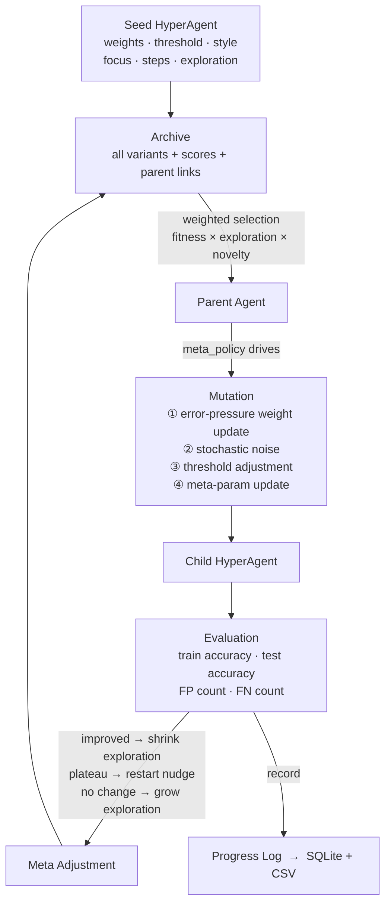

# hyperagents

`hyperagents` is a Python research artifact inspired by the HyperAgents paper (`arXiv:2603.19461v1`).

The core idea: an agent that improves not just its task behaviour but also the policy that *produces* future improvements — **metacognitive self-modification**.

- A **task policy** solves a domain task (code-repository quality classification).
- A **meta policy** controls how the task policy mutates each iteration.
- A **hyperagent** bundles both into one editable record — so the mutation procedure is itself an evolvable artefact.
- An **archive** stores every discovered variant as a stepping-stone, enabling exploration past local optima.

No frontend is included. Everything runs from the command line or via the REST API.

---

## What Is Implemented

### Core engine (`backend/app/engine.py`)

- Evolutionary HyperAgent loop: weighted archive parent selection, error-pressure mutation, 3 ablation conditions
- **Weight-space novelty**: parent selection uses k=3 nearest-neighbour mean Euclidean distance in the 5D weight space — a real diversity signal rather than a generation-depth proxy
- **Plateau detection**: if no fitness improvement in 5 consecutive iterations, applies a stronger restart nudge (exploration scale +0.10, weight_step reset to mid-range) to escape local optima
- Three ablation conditions selectable at runtime:

| Condition | Internal name | Archive selection | Meta-policy update |
|---|---|---|---|
| Full system | `hyperagent` | Weighted full archive | Adaptive each iteration |
| Frozen meta | `baseline` | Weighted full archive | Fixed at seed values |
| No archive | `no_archive` | Always current best | Adaptive each iteration |

### Self-improving prompt engine (`backend/app/selfimprovingprompt/`)

A second evolvable artefact: instead of numerical weights, evolve a **text prompt** used to review codebases.

- Fitness = normalised human rating: `(rating − 1) / 4.0`
- Each iteration: run the active prompt → rate 1–5 → submit strengths + gaps → get improved prompt
- LLM-guided mutation if OpenAI is configured; heuristic fallback otherwise
- Archive keeps every evaluated prompt variant
- Active prompt optionally written to disk after each cycle (`REVIEWER_PROMPT_PATH`)
- Exposed via `/api/promptagent/{state,reset,submit,export}`

### Experiment infrastructure

- `scripts/run_experiment.py` — 3 conditions × 5 seeds × N iterations → `results/raw_metrics.csv`
- `scripts/plot_results.py` — learning curves (train + test) and meta-policy drift figures
- SQLite persistence: every run, agent variant, per-iteration metric, and mutation event stored immediately

### Dataset

- 20 training repositories (8 accepted, 12 rejected) — 10 clearly separated + 10 borderline
- 10 held-out test repositories (4 accepted, 6 rejected)
- Seed agent starts at ~65% train accuracy, leaving meaningful room for improvement

---

## Project Structure

```text
hyperagents/
├── backend/
│   ├── app/
│   │   ├── engine.py                   # Core evolutionary loop
│   │   ├── datasets.py                 # 20 train + 10 test repo fixtures
│   │   ├── database.py                 # SQLModel tables + Database class
│   │   ├── main.py                     # FastAPI app + route handlers
│   │   ├── openai_service.py           # Optional LLM mutation planner
│   │   ├── account_service.py          # Synthetic + GitHub repo generation
│   │   ├── github_service.py           # GitHub API integration
│   │   ├── settings.py                 # Env-driven config
│   │   ├── prompts/
│   │   │   ├── propose_mutation.md     # LLM prompt: weight mutation
│   │   │   └── review_repository.md   # LLM prompt: live repo review
│   │   └── selfimprovingprompt/
│   │       ├── engine.py               # PromptEngine — evolves text prompts
│   │       └── prompts/
│   │           └── mutate_agent_prompt.md  # LLM prompt: prompt mutation
│   └── pyproject.toml
├── scripts/
│   ├── run_experiment.py               # Multi-seed ablation runner
│   └── plot_results.py                 # Matplotlib learning curves + meta drift
├── docs/
│   ├── GUIDE.md                        # Start here
│   ├── architecture.md                 # Full architecture reference
│   └── methods.md                      # Methods section draft (arXiv paper)
├── results/                            # Auto-created; gitignored
├── experiments/                        # Cleaned CSVs committed for the paper
└── figures/                            # Paper-ready output figures
```

---

## Quick Start

**Requirements:** Python 3.11+

```bash
cd backend
pip install -e .
uvicorn app.main:app --host 0.0.0.0 --port 8000 --reload
```

API is now available at `http://localhost:8000`. Interactive docs at `http://localhost:8000/docs`.

---

## Running the Ablation Experiment (CLI)

Generate the CSV and plots used in the paper:

```bash
# from repo root, with backend venv active
python scripts/run_experiment.py --iterations 30 --seeds 5
python scripts/plot_results.py
```

Outputs:
- `results/raw_metrics.csv` — per-iteration scores for all conditions and seeds
- `results/learning_curves.png` — train + test accuracy learning curves
- `results/meta_policy_drift.png` — meta-policy parameter trajectories

Key result: the **no_archive** condition plateaus at ~80% train accuracy while both archive conditions reach ~85%, demonstrating the stepping-stones contribution of the archive.

---

## Running the Ablation Experiment (API)

```bash
# Reset to a condition
curl -X POST http://localhost:8000/api/reset -H "Content-Type: application/json" \
     -d '{"mode": "hyperagent"}'

# Run iterations
curl -X POST http://localhost:8000/api/run -H "Content-Type: application/json" \
     -d '{"iterations": 30}'

# Fetch metrics
curl http://localhost:8000/api/metrics/json
curl http://localhost:8000/api/metrics/csv
```

---

## Using the Self-Improving Prompt Engine

```bash
# Get the active (seed) prompt
curl http://localhost:8000/api/promptagent/state | jq .active_prompt

# After running the prompt against your codebase, submit the result
curl -X POST http://localhost:8000/api/promptagent/submit \
     -H "Content-Type: application/json" \
     -d '{
       "review_text": "<the full review output>",
       "rating": 3,
       "strengths": ["Good security coverage", "Clear structure"],
       "gaps": ["No line-level citations", "Missing test coverage analysis"],
       "codebase_ref": "my-repo @ main"
     }' | jq .new_prompt

# Export the best prompt found so far
curl http://localhost:8000/api/promptagent/export | jq -r .prompt > code-reviewer.md
```

Repeat until the prompt converges to a rating of 4–5.

---

## OpenAI Integration (optional)

Create `backend/.env.local`:

```
OPENAI_API_KEY=your_key_here
OPENAI_MODEL=gpt-4o-mini
HYPERAGENTS_USE_OPENAI=1
```

When enabled, both the weight-mutation planner and the prompt-mutation engine use the OpenAI Responses API. Without these variables the system runs fully offline using the deterministic heuristic engine.

> Never commit API keys. If a key is exposed, revoke it immediately.

---

## Architecture



> Full diagrams, DB schema, and API reference: [`docs/architecture.md`](docs/architecture.md)

---

## Why This Matches The Paper

The paper's key mechanism is not just recursive optimisation — it is **metacognitive self-modification**: the procedure that creates future improvements is itself editable.

- `task_policy` controls how a repository is scored and classified
- `meta_policy` controls how future mutations are proposed
- both live inside the same mutable agent record
- both can be modified by the system during a run

The self-improving prompt engine extends this idea to natural language: the prompt is the task policy, and the mutation strategy (gap-driven heuristic or LLM) is the meta policy.

---

## Extending the Project

- Replace the heuristic mutation operator with a fully LLM-driven one (prompts already in `backend/app/prompts/`)
- Swap the synthetic dataset for a real code-quality benchmark
- Implement the `Domain` Protocol from the tech spec to support multiple task domains without engine changes
- Add `POST /api/experiment` to trigger the full 3×5×30 matrix via API (currently CLI only)
- Add MAP-Elites or quality-diversity selection for broader archive coverage
