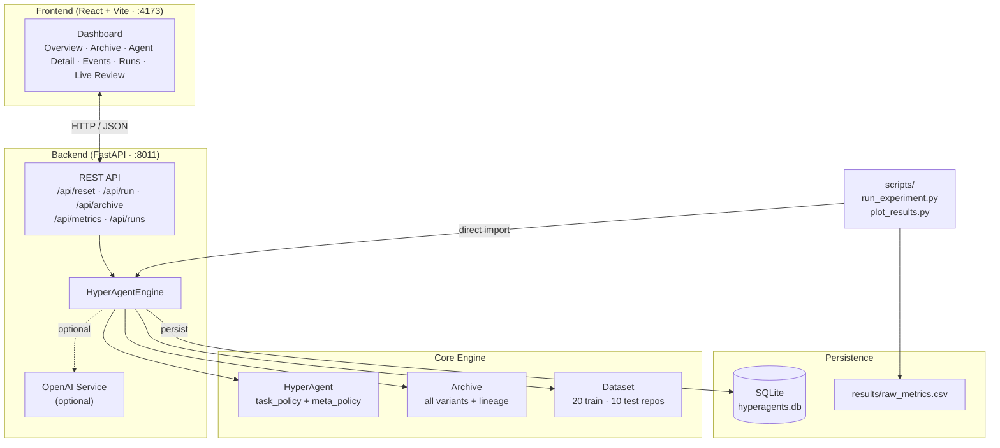
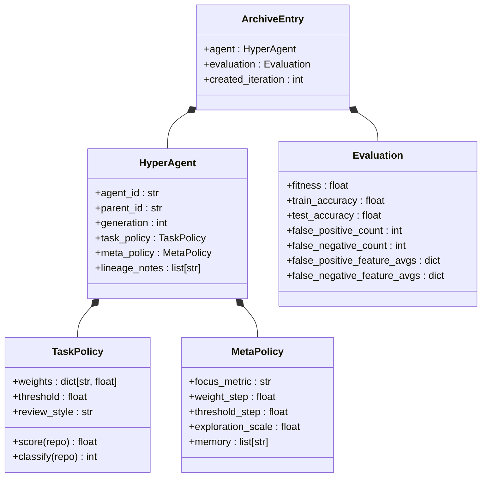
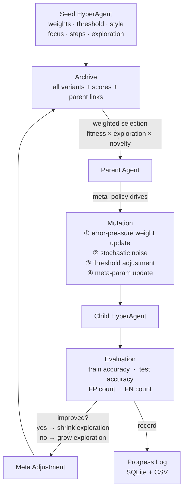
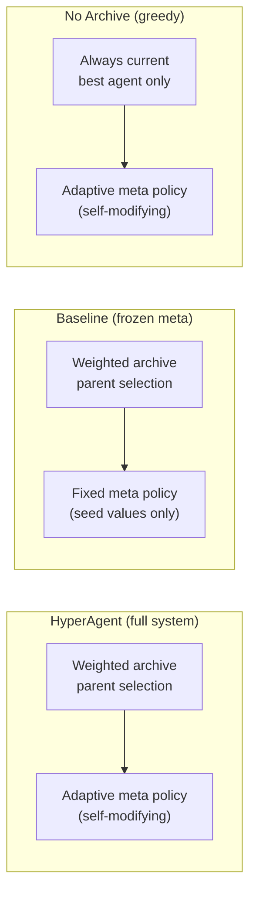
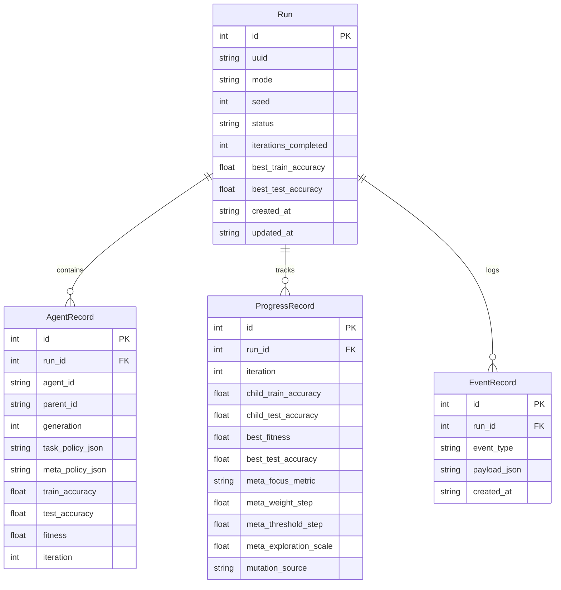
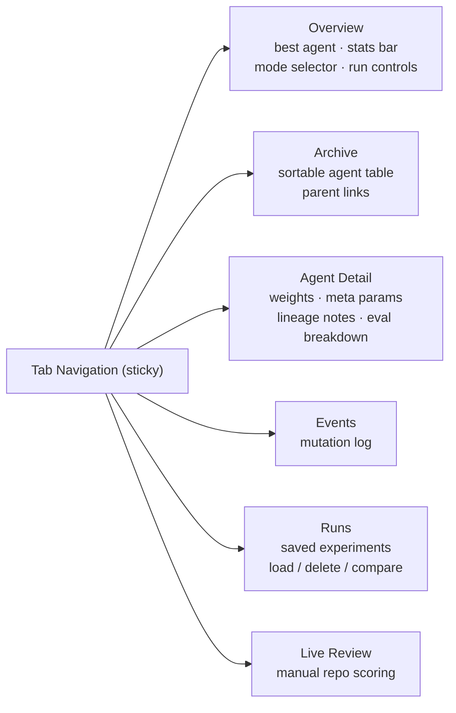

# Architecture

## 1. System Overview



---

## 2. HyperAgent Structure



The key structural property from the paper (arXiv:2603.19461v1): **both policies reside
in the same mutable record** — the procedure that produces future variants is itself
an editable artefact.

---

## 3. Evolutionary Loop



### Loop Steps (numbered)

| # | Step | Key action |
|---|------|------------|
| 1 | Parent selection | Weighted sample from archive: `P ∝ fitness × exploration_scale × (1 + generation)⁻¹` |
| 2 | Mutation | Error-pressure drives weight direction; `exploration_scale` sets noise amplitude |
| 3 | Evaluation | Score child on all 20 train + 10 test repos |
| 4 | Post-eval meta-adjust | `exploration_scale ↓` on improvement, `↑` otherwise |
| 5 | Archive update | Child unconditionally added (stepping-stones property) |
| 6 | Progress record | Metrics written to SQLite and in-memory log |

---

## 4. Ablation Conditions



| Condition | Archive selection | Meta-policy update | Isolates |
|-----------|-------------------|--------------------|----------|
| **HyperAgent** | Weighted full archive | Adaptive | — (full system) |
| **Baseline** | Weighted full archive | Frozen at seed | Meta-policy contribution |
| **No Archive** | Always current best | Adaptive | Archive contribution |

---

## 5. Database Schema



---

## 6. API Endpoints

| Method | Path | Description |
|--------|------|-------------|
| `POST` | `/api/reset` | Initialise a new run; body: `{mode}` |
| `POST` | `/api/run` | Execute N iterations; body: `{iterations}` |
| `GET`  | `/api/status` | Current engine state |
| `GET`  | `/api/archive` | All archive entries |
| `GET`  | `/api/metrics/json` | Per-iteration metrics as JSON |
| `GET`  | `/api/metrics/csv` | Per-iteration metrics as CSV download |
| `GET`  | `/api/runs` | Saved run list |
| `GET`  | `/api/runs/{id}` | Single run snapshot |
| `POST` | `/api/runs/{id}/load` | Restore a saved run into engine |
| `DELETE` | `/api/runs/{id}` | Delete a saved run |
| `POST` | `/api/review` | Live repo review (optional OpenAI) |

---

## 7. Frontend Tab Map



---

## 8. Directory Layout

```text
hyperagents/
├── backend/
│   ├── app/
│   │   ├── datasets.py          # 20 train + 10 test repo fixtures
│   │   ├── database.py          # SQLModel tables + Database class
│   │   ├── engine.py            # HyperAgentEngine (core loop)
│   │   ├── main.py              # FastAPI app + route handlers
│   │   ├── openai_service.py    # Optional LLM mutation planner
│   │   ├── settings.py          # Env-driven config (port, db path, OpenAI)
│   │   └── prompts/             # .md prompt templates for OpenAI calls
│   └── pyproject.toml
├── frontend/
│   └── src/
│       ├── App.jsx              # Tabbed dashboard
│       ├── api.js               # Typed fetch wrappers
│       └── styles.css
├── scripts/
│   ├── run_experiment.py        # Multi-seed ablation runner → CSV
│   └── plot_results.py          # Matplotlib learning curves + meta drift
├── docs/
│   ├── architecture.md          # This file
│   └── methods.md               # Methods section draft (arXiv paper)
├── results/
│   ├── raw_metrics.csv          # 3 conditions × 5 seeds × 30 iterations
│   ├── learning_curves.png      # Train + test accuracy panels
│   └── meta_policy_drift.png    # Weight step / threshold step / exploration
├── run.ps1                      # One-command local start (Windows)
└── stop.ps1                     # One-command local stop
```
