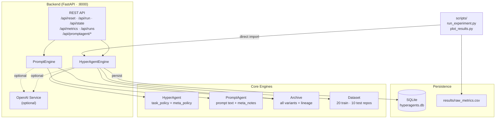
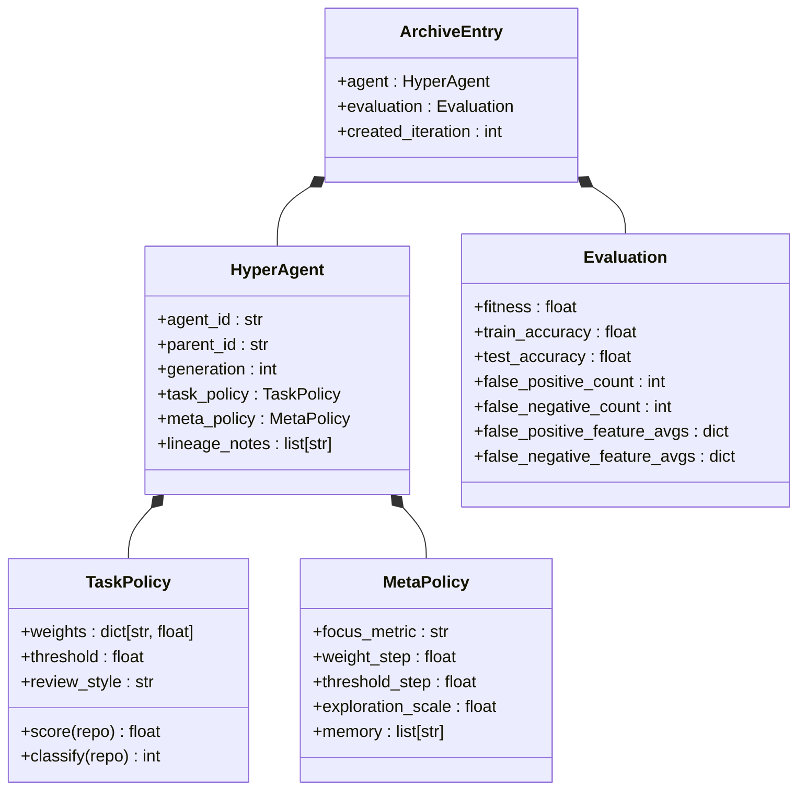
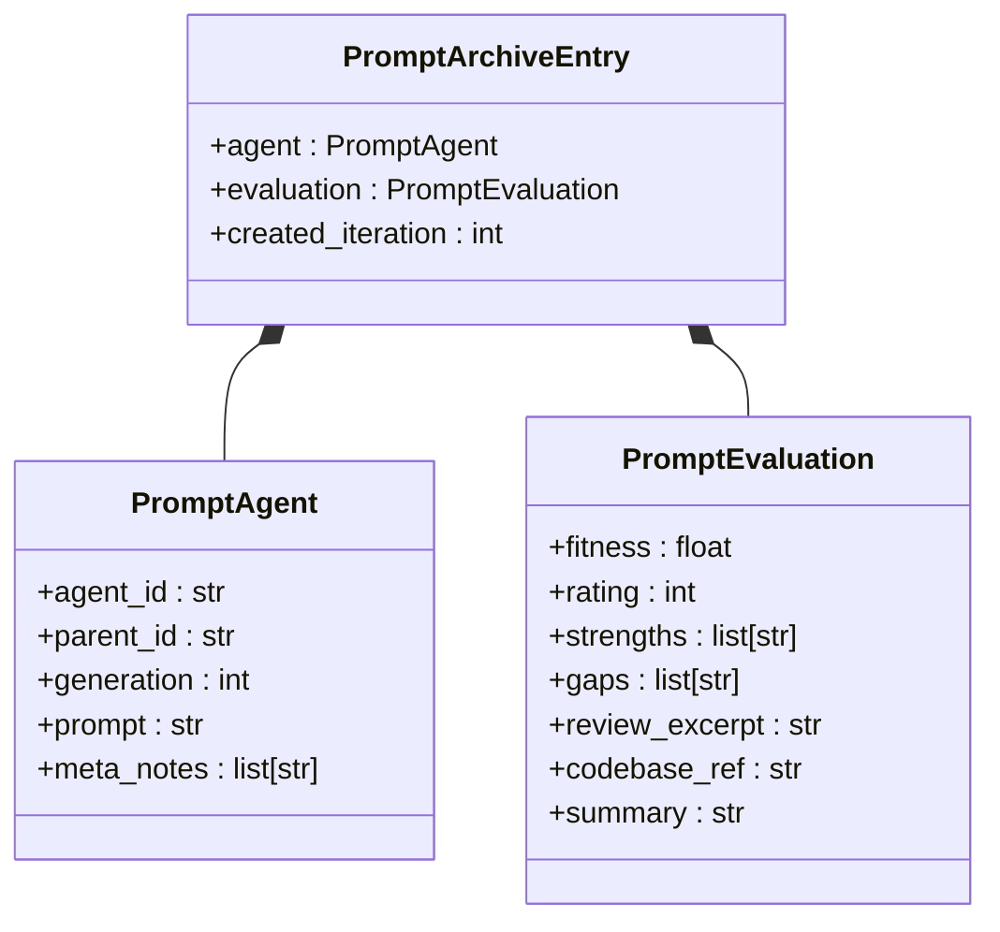
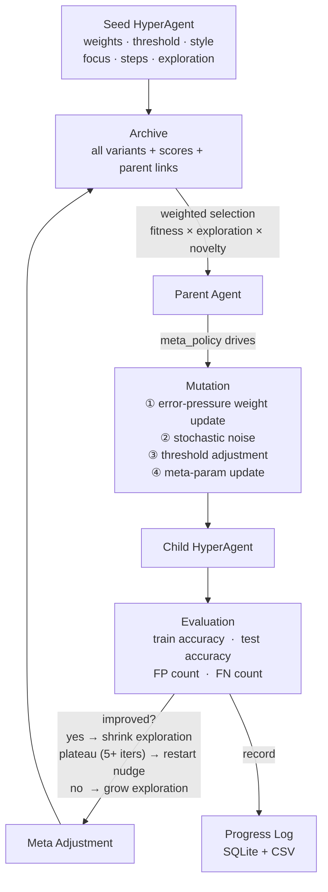
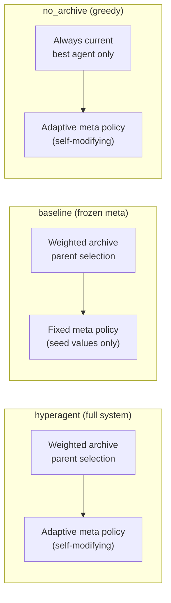
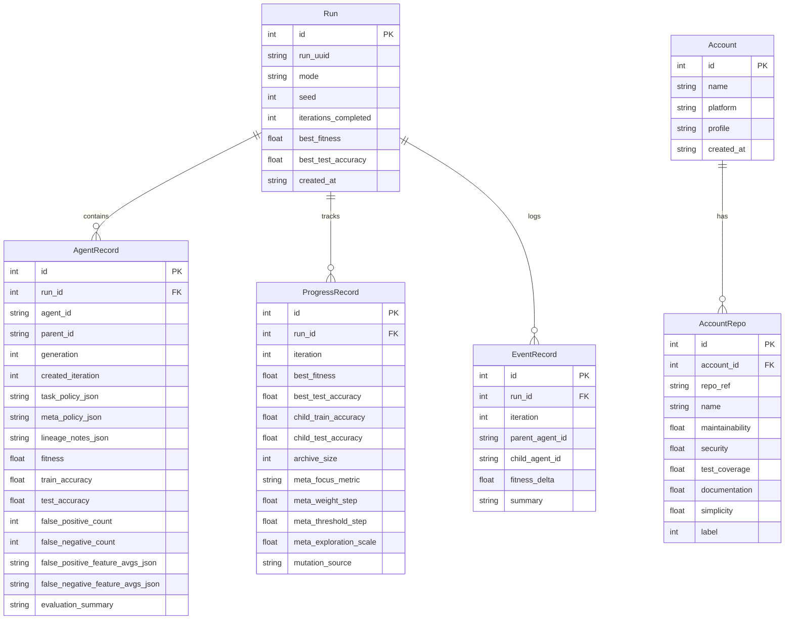

# Architecture

## 1. System Overview



No frontend is included. All interaction is via the REST API or the CLI scripts.

---

## 2. HyperAgent Structure



The key structural property from the paper (arXiv:2603.19461v1): **both policies reside
in the same mutable record** — the procedure that produces future variants is itself
an editable artefact.

---

## 3. PromptAgent Structure



The `PromptEngine` applies the same archive + mutation pattern as `HyperAgentEngine`,
but the evolvable artefact is a natural-language code-reviewer prompt rather than
a set of numeric weights. Fitness is the normalised human rating: `(rating − 1) / 4.0`.

---

## 4. Evolutionary Loop



### Loop Steps

| # | Step | Key action |
|---|------|------------|
| 1 | Parent selection | Weighted sample: `P ∝ fitness × exploration_scale × weight_space_novelty` |
| 2 | Mutation | Error-pressure drives weight direction; `exploration_scale` sets noise amplitude |
| 3 | Evaluation | Score child on all 20 train + 10 test repos |
| 4 | Post-eval meta-adjust | `exploration_scale ↓` on improvement; plateau restart nudge after 5 stuck iterations |
| 5 | Archive update | Child unconditionally added (stepping-stones property) |
| 6 | Progress record | Metrics written to SQLite and CSV |

### Weight-Space Novelty

Parent selection uses k=3 nearest-neighbour mean Euclidean distance in the 5D weight
space as a novelty signal, normalised to [0, 1]:

```
novelty_score = 1.0 + normalised_knn_distance × 0.30
```

This replaces the old generation-depth proxy, grounding diversity pressure in the
actual parameter space rather than tree depth.

### Plateau Detection

If no fitness improvement occurs for 5 consecutive iterations, the post-evaluation
meta-adjustment fires a stronger restart nudge:
- `exploration_scale += 0.10` (vs normal +0.05)
- `weight_step` reset to mid-range `0.13`

---

## 5. Ablation Conditions



| Condition | Archive selection | Meta-policy update | Isolates |
|---|---|---|---|
| `hyperagent` | Weighted full archive | Adaptive | — (full system) |
| `baseline` | Weighted full archive | Frozen at seed | Meta-policy contribution |
| `no_archive` | Always current best | Adaptive | Archive contribution |

---

## 6. Database Schema



---

## 7. API Endpoints

### Engine

| Method | Path | Description |
|---|---|---|
| `GET` | `/api/state` | Current engine state |
| `POST` | `/api/reset` | Start a new run; body: `{"mode": "hyperagent\|baseline\|no_archive"}` |
| `POST` | `/api/run` | Execute N iterations; body: `{"iterations": N}` |
| `GET` | `/api/metrics/json` | Per-iteration metrics as JSON |
| `GET` | `/api/metrics/csv` | Per-iteration metrics as CSV download |

### Run management

| Method | Path | Description |
|---|---|---|
| `GET` | `/api/runs` | List all saved runs |
| `GET` | `/api/runs/{id}` | Single run snapshot |
| `POST` | `/api/runs/{id}/load` | Restore a saved run into engine |
| `DELETE` | `/api/runs/{id}` | Delete a saved run |

### Self-improving prompt engine

| Method | Path | Description |
|---|---|---|
| `GET` | `/api/promptagent/state` | Active prompt, archive, iteration count |
| `POST` | `/api/promptagent/reset` | Start fresh; body: `{"seed_prompt": "..."}` optional |
| `POST` | `/api/promptagent/submit` | Record a review result; returns improved prompt |
| `GET` | `/api/promptagent/export` | Best prompt found so far |

### Accounts

| Method | Path | Description |
|---|---|---|
| `POST` | `/api/accounts` | Add a synthetic or GitHub account |
| `GET` | `/api/accounts` | List accounts |
| `GET` | `/api/accounts/{id}/repos` | Repos for one account |
| `DELETE` | `/api/accounts/{id}` | Delete account |
| `POST` | `/api/accounts/apply-all` | Push all account repos into the engine dataset |

### Live review (requires OpenAI)

| Method | Path | Description |
|---|---|---|
| `POST` | `/api/review-repo` | Score a GitHub repo with the best agent + LLM |

---

## 8. Directory Layout

```text
hyperagents/
├── backend/
│   ├── app/
│   │   ├── engine.py                   # HyperAgentEngine — core evolutionary loop
│   │   ├── datasets.py                 # 20 train + 10 test repo fixtures
│   │   ├── database.py                 # SQLModel tables + Database class
│   │   ├── main.py                     # FastAPI app + route handlers
│   │   ├── openai_service.py           # Optional LLM mutation planner
│   │   ├── account_service.py          # Synthetic + GitHub repo generation
│   │   ├── github_service.py           # GitHub API wrapper
│   │   ├── settings.py                 # Env-driven config (reads .env.local)
│   │   ├── prompts/
│   │   │   ├── propose_mutation.md     # LLM prompt: weight mutation
│   │   │   └── review_repository.md   # LLM prompt: live repo review
│   │   └── selfimprovingprompt/
│   │       ├── engine.py               # PromptEngine — evolves text prompts
│   │       └── prompts/
│   │           └── mutate_agent_prompt.md  # LLM prompt: prompt mutation
│   └── pyproject.toml
├── scripts/
│   ├── run_experiment.py               # 3 conditions × 5 seeds × N iters → CSV
│   └── plot_results.py                 # Learning curves + meta drift figures
├── docs/
│   ├── GUIDE.md                        # Start here
│   ├── architecture.md                 # This file
│   └── methods.md                      # Methods section draft
├── results/                            # Auto-created at runtime; gitignored
├── experiments/                        # Cleaned CSVs committed for the paper
└── figures/                            # Paper-ready output figures
```
